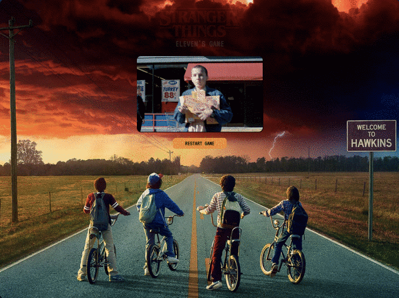
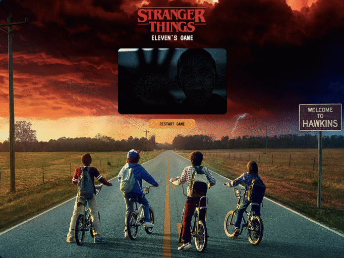

# SEI Project 1 - A Stranger Things themed variation on the classic game Pac Man
See the game online at  https://gaebar.github.io/eleven-s-game/


### Timeframe & Team
> 7 days, solo

### The Brief
 - Render a grid-based game in the browser.
 - Design logic for winning & visually display which player won.
 - Include separate HTML / CSS / JavaScript files.
 - Use Javascript or jQuery for DOM manipulation.
 - Use semantic markup for HTML and CSS (adhere to best practices).
 - The player should be able to clear at least one board.
 - The player's score should be displayed at the end of the game.
 - Responsive design.
 - Each board gets more difficult.
 - Persistent leaderboard using localStorage.

### Additional
Add ghost follow logic where ghosts chase PacMan.

### Tech Stack
 - HTML5 / HTML Audio
 - CSS3
 - JavaScript - ECMAScript6
 - Animate.css
 - SCSS
 - Flexbox
 - Git & GitHub
 
 ### Installation
 This game uses vanilla javascript and ES6 Javascript modules. There is no compilation step, but you might want to install the eslint packages in order to lint the code and check for formatting errors.
 
 Clone this repository:
 
 ``git clone https://github.com/gaebar/eleven-s-game``
 
 Install dependencies:
 
 ``npm install``
 
 Start a local web server in the project root folder:
 
 ``python3 -m http.server``
 
 You should now be able to run the website from http://0.0.0.0:8000/index.html
 
___

## Game Summary

Eleven’s Game is a Stranger Things themed variation on the classic game Pac Man, a one-player game against a computer AI which intelligently hunts down the player. The Demogorgons have full follow logic and will track Eleven down or run away after Eleven eats a powerup.


### Instructions & Game Controls
Control Eleven with your keyboard (arrow keys) and save the humanity from the impending invasion of the monsters from the Upside Down world.

Follow the pumpkin seeds and collect as many Eggo's Waffles as you can. Once you eat an Eggo, the Demogorgons can be scared away into their nest. You have three lives!

* Press Start Game to begin
* Use the  ← ↑ → ↓ keys to move Eleven around the grids
* To play again when you loose the three lives, click Restart Game


### Query String Paramenters
 - https://gaebar.github.io/sei-project-1/?screen-state=game to start the game directly
 
 ___

## Process 

A project built in just over a week, which was both the first full-fledged game I had built and my first project using Vanilla JavaScript, having only been studying it for two weeks. 

### Creating Grids and Ghosts and Egos Placement

The first task in making the Eleven's Game was to create a grid. After some attempts with the provided grid, I've decided to created the level maps grid using an Array of string - See level maps in "LevelsStorage.js". 

### Wins
Using the array of strings as reference I was able to draw the complete grid with characters on the "game-board.CSS" file sheet. Doing so the monsters and Eleven are free to move around the gameboard and not allowed to cross the walls.

 Map Tiles Types - Correspondence between map codes and DOM classes:

```javascript
tileTypes = {
  'wall': '■',
  'food': '·',
  'eggo': '+',
  'upside': 'U',
  'eleven': 'E',
  'demogorgon': 'D',
  'target': 'T',
  'empty': ' '
}
 ```

 DOM Gameboard
 ```javascript
   level1 = [
    '■■■■■■■■■■■■■■■■■■■■■■■■■■■■',
    '■T···········■■···········T■',
    '■·■■■■·■■■■■·■■·■■■■■·■■■■·■',
    '■+■  ■·■   ■·■■·■   ■·■  ■+■',
    '■·■■■■·■■■■■·■■·■■■■■·■■■■·■',
    '■··························■',
    '■·■■■■·■■·■■■■■■■■·■■·■■■■·■',
    '■·■■■■·■■·■■■■■■■■·■■·■■■■·■',
    '■······■■····■■····■■······■',
    '■■■■■■·■■■■■ ■■ ■■■■■·■■■■■■',
    '     ■·■■■■■ ■■ ■■■■■·■     ',
    '     ■·■■          ■■·■     ',
    '     ■·■■ ■■■UU■■■ ■■·■     ',
    '■■■■■■·■■ ■UDUUUD■ ■■·■■■■■■',
    '      ·   ■UUUUUU■   ·      ',
    '■■■■■■·■■ ■DUUUDU■ ■■·■■■■■■',
    '     ■·■■ ■■■■■■■■ ■■·■     ',
    '     ■·■■          ■■·■     ',
    '     ■·■■ ■■■■■■■■ ■■·■     ',
    '■■■■■■·■■ ■■■■■■■■ ■■·■■■■■■',
    '■············■■············■',
    '■·■■■■·■■■■■·■■·■■■■■·■■■■·■',
    '■·■■■■·■■■■■·■■·■■■■■·■■■■·■',
    '■+··■■···D··· E·······■■··+■',
    '■■■·■■·■■·■■■■■■■■·■■·■■·■■■',
    '■■■·■■·■■·■■■■■■■■·■■·■■·■■■',
    '■······■■····■■····■■······■',
    '■·■■■■■■■■■■·■■·■■■■■■■■■■·■',
    '■·■■■■■■■■■■·■■·■■■■■■■■■■·■',
    '■T········T···············T■',
    '■■■■■■■■■■■■■■■■■■■■■■■■■■■■'
  ]
```
 
To help the players enjoy their experience, I added some extra touches:
* Once the player press ``Start Game``, you can hear Eleven's voice saying ``Friends don't lie!``, then the Stranger Things theme song begins playing and the player is ready to help Eleven save the world.
* I added some animated GIFs which replace the initial instructions, during key moments for the game. 

Win Game: Eleven happily leaves the game with hands full of Eggo's. 



Lose Game: Eleven asks for help.



___

### Challenges
I initially wanted to use Canvas API to display the game animations, as I wanted continues fluid movements and transitions, however the point of making this game was how to use DOM manipulation methods for a more complex project.

Later on in my studies, I realized that using a library  for DOM manipulation and state management would been very useful. I had to code these these elements in using vanilla JavaScript which was challenging, but a great learning opportunity. If I had to build the project again, I would have used React and Redux to make it easier to handle the application state.

In this project the game state is held in the [Board](https://github.com/gaebar/eleven-s-game/blob/master/scripts/game/board.js#L8) class.

A challenging part of the project was to update the Player location on the board, and ensuring the player won't move past walls. In order to do so, I first calculate the next Player position according to the user input, but only update the position is the next position is not a wall.

```javascript
updateElevenPosition(keyCode) {
  const nextElevenPosition = this.getNextCharacterAcceptablePosition(this.eleven.position, keyCode)
  if (this.isWall(nextElevenPosition))
    return

  const oldElevenElement = this.boardTilesElements[this.eleven.position[0]][this.eleven.position[1]]
  oldElevenElement.classList.remove('cell-eleven')
  this.eleven.position = nextElevenPosition
  const currentElevenElement = this.boardTilesElements[this.eleven.position[0]][this.eleven.position[1]]
  currentElevenElement.classList.add('cell-eleven')
}

isWall(position) {
  const selectedTile = this.boardTiles[position[0]][position[1]]
  return selectedTile.tileTypeChar === this.tileTypes.wall
}
```

Another challenging component was to create several game modes, one where the player is chased by monster and another where the monsters are hunted by the player instead. There is also a timer that returns to the original mode after a few seconds.

```javascript
eatEggo(position) {
  this.updateScore(100)
  const tileElement = this.boardTilesElements[position[0]][position[1]]
  tileElement.classList.remove('cell-eggo')

  const selectedTile = this.boardTiles[position[0]][position[1]]
  selectedTile.tileTypeChar = this.tileTypes.empty

  this.updateGameMode(this.gameModeTypes.standard, this.gameModeTypes.eggosMode)

  window.clearTimeout(this.eggosModeTimeout)
  this.eggosModeTimeout = window.setTimeout((() => {
    this.updateGameMode(this.gameModeTypes.eggosMode, this.gameModeTypes.standard)
  }).bind(this), 5000)
}

updateGameMode(oldGameModeType, newGameModeType) {
  this.gameModeType = newGameModeType
  document.body.classList.remove('game-' + oldGameModeType)
  document.body.classList.add('game-' + newGameModeType)
}
```

Moving Demogorgons on the screen also proved difficult. After many attempts, I went for a logic where the monsters follow targets that are either the player or a random point on the map, to ensure the level of difficulty for the player is not too high.

There is also a quite complex to ensure monsters move in the direction of the targets. This is achieved by calculating the geometric distance between the monster and the target in every possible direction, and then going towards the shortest path.

To avoid monsters getting stuck in corners, I have added an incentive for when the next position goes along the same direction the monster is currently traveling towards.

```javascript
moveDemogorgons() {
  this.updateTargets()
  this.demogorgons.forEach((demogorgon, index) => {
    const positionDirection = this.getClosestAllowedPosition(demogorgon, this.targets[index])
    demogorgon.direction = positionDirection.direction
    this.updateDemogorgonPosition(demogorgon, positionDirection.nextPosition)
  })
}

updateTargets() {
  this.targets.forEach((target) => {
    if (Math.random() > 0.9) {
      target[0] = Math.floor(Math.random() * this.maxRow)
      target[1] = Math.floor(Math.random() * this.maxColumn)
    } else if (Math.random() > 0.9) { // chase Eleven
      target[0] = this.eleven.position[0]
      target[1] = this.eleven.position[1]
    }
  })
}

getClosestAllowedPosition(demogorgon, target) {
  const possibleNextPositions = []
  Object.keys(this.directions).forEach(function (key) {
    const nextPosition = this.getNextCharacterAcceptablePosition(demogorgon.position, this.directions[key])
    let distanceFromTarget = this.calculateDistanceFromTarget(nextPosition, target)

    if (this.isWall(nextPosition))
      return

    // reduce the distance from target to discourage the demogorgon from changing direction
    if (demogorgon.direction === this.directions[key])
      distanceFromTarget = distanceFromTarget * 0.9

    possibleNextPositions.push({
      nextPosition: nextPosition,
      distanceFromTarget: distanceFromTarget,
      direction: this.directions[key]
    })
  }.bind(this))

  // sort possible demogorgons move directions by distance, using the array sort method
  // https://developer.mozilla.org/en-US/docs/Web/JavaScript/Reference/Global_Objects/Array/sort
  possibleNextPositions.sort((position2, position1) => {
    return position2.distanceFromTarget - position1.distanceFromTarget
  })

  return possibleNextPositions[0]
}

calculateDistanceFromTarget(position1, position2) {
  return Math.round(Math.sqrt(((position1[0] - position2[0]) ** 2) + ((position1[1] - position2[1]) ** 2)) * 10) / 10
}
```
 ___
 ## Key Learnings

Eleven's Game was the first project that I've to planning a complex code structure and while working I've realized how important it was to use several folder to make a DRY and clear code.

 Working on this project I found out that I needed more other key skills then just know how to code. I had a thought about my Problem Solving skills and agreed with some article on the web that includes:

- Creativity.
- Researching Skills.
- Team Working. 
- Emotional Intelligence. 
- Risk Management. 
- Decision Making.
 ___
 
 ## Future Improvements
 #### Eleven defeat Demogorgon (Ghosts) and add more characters:

 - If I had more time, I would have like to improve the game. Ghosts follow Eleven during the game and runs away from her and start to flash when she eats an Eggo. However, it is still not possible for Eleven to defeat the Ghosts.
 
- More, make the players choose one of their favourite characters from the Stranger Things Tv Show.

## Resources
 - [Pac-Man Arceade gameplay - Youtube](https://www.youtube.com/watch?v=uswzriFIf_k)
 - [Pac-Man -Wikipedia](https://en.wikipedia.org/wiki/Pac-Man)

### Inspiration Material
These articles describe how the ghosts in the original pac-man behave:
 - [The Pac-Man Dossier](http://www.gamasutra.com/view/feature/3938/the_pacman_dossier.php?print=1)
 - [Ghost Psycology](https://www.webpacman.com/ghosts.html)
 - [Understanding Pac-man Ghost behavior](http://gameinternals.com/post/2072558330/understanding-pac-man-ghost-behavior)
